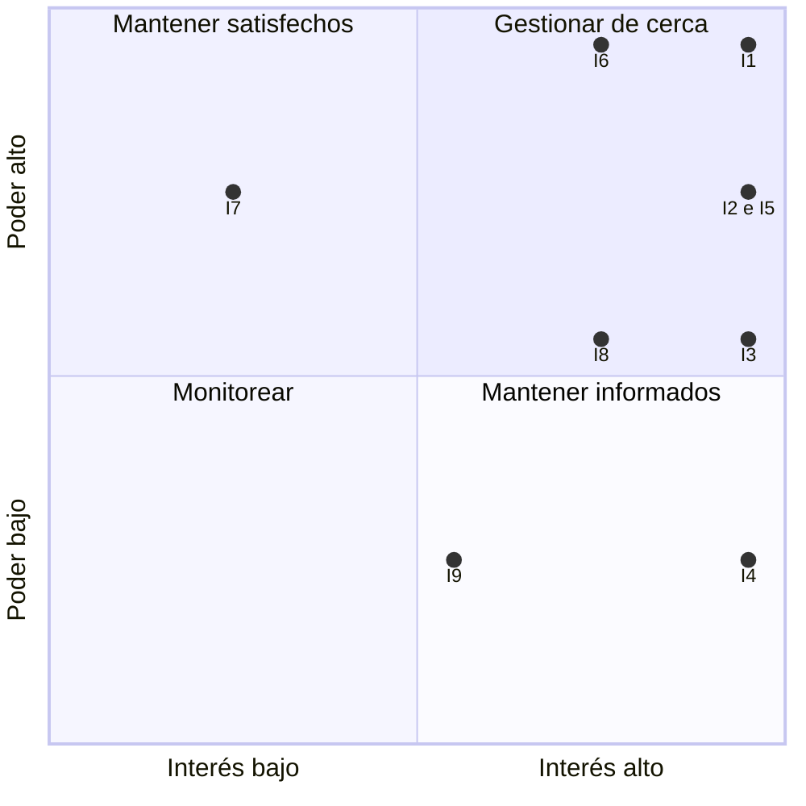

# VetCare

## Sistema de Gestión de Atención Veterinaria

**Universidad Técnica Nacional — Sede San Carlos**

**Curso:** Administración de Proyectos Informáticos, III-26, SC-02

**Profesor:** Deiver Cubero Molina

**Estudiantes:** Jose Pablo Soto Quesada y Maikel Chaves Salas

**Fecha:** Septiembre 2026

## Problema

Las clínicas veterinarias necesitan administrar información de diferentes clientes y sus mascotas, pero en algunos casos estos datos pueden encontrarse registrados en documentos físicos, hojas de cálculo o diferentes medios de comunicación. Esto puede dificultar el acceso y control de la información. Además, un mismo cliente puede tener varias mascotas, por lo que es necesario mantener organizada la información de cada una de ellas de manera independiente. También puede ser complicado para los médicos veterinarios consultar rápidamente el historial de una mascota, sus consultas anteriores, vacunas, tratamientos y próximas citas. La falta de un sistema centralizado puede generar pérdida de información, dificultades para organizar las citas y mayor tiempo para consultar los datos de los pacientes.

## Proyecto propuesto

Desarrollar un sistema web para la gestión de una clínica veterinaria, dirigido tanto a los clientes como a los médicos veterinarios. El sistema permitirá a los clientes registrarse y administrar su información, así como registrar una o varias mascotas asociadas a su cuenta. También podrán consultar la información de sus mascotas y gestionar sus citas. Por otra parte, los médicos veterinarios podrán consultar sus citas y acceder al expediente de cada mascota para registrar y consultar información relacionada con las consultas, diagnósticos, tratamientos, vacunas y observaciones. El sistema permitirá centralizar la información y mantener una relación organizada entre los clientes y sus mascotas, de manera que cada mascota tenga su propio historial de atención veterinaria.

## Valor esperado

Se espera que el sistema permita mejorar la organización y administración de la información de la clínica veterinaria, facilitando tanto el trabajo de los médicos como la gestión de los clientes.

El proyecto busca:

- Centralizar la información de clientes y mascotas. Permitir que un cliente pueda registrar y administrar varias mascotas. Mantener un expediente independiente para cada mascota. Facilitar a los médicos veterinarios el acceso al historial de sus pacientes. Mejorar la gestión y organización de las citas. Facilitar el seguimiento de vacunas y tratamientos. Reducir la dependencia de documentos físicos y registros dispersos.
- Permitir que los clientes puedan consultar información relacionada con sus mascotas.
- Mejorar el control y seguimiento de la atención brindada a cada paciente.

## Objetivo general

Desarrollar un sistema web para la gestión de una clínica veterinaria que permita administrar la información de clientes, mascotas, médicos veterinarios, citas e historiales médicos, facilitando el seguimiento y control de la atención de cada mascota.

## Objetivos específicos

1. Analizar los procesos relacionados con la administración de clientes, mascotas, citas e información médica dentro de una clínica veterinaria.
2. Diseñar una base de datos que permita relacionar a los clientes con una o varias mascotas y almacenar de manera organizada la información de cada paciente.
3. Desarrollar un módulo para el registro y administración de clientes, permitiendo mantener actualizada su información personal y de contacto.
4. Implementar un módulo que permita a los clientes registrar y administrar varias mascotas asociadas a su cuenta.
5. Desarrollar un módulo de gestión de citas que permita registrar, consultar y administrar las citas de las mascotas.
6. Implementar un expediente médico digital para cada mascota, permitiendo registrar consultas, diagnósticos, tratamientos, vacunas y observaciones.
7. Desarrollar funcionalidades para que los médicos veterinarios puedan consultar el historial médico de sus pacientes y registrar nueva información durante las consultas.
8. Permitir que los clientes puedan consultar la información y el historial de atención de sus mascotas.
9. Implementar diferentes niveles de acceso para clientes y médicos veterinarios, de acuerdo con las funciones que corresponden a cada tipo de usuario.
10. Realizar pruebas del sistema para verificar el correcto funcionamiento de sus principales módulos y garantizar que la información sea gestionada de manera adecuada.

## Gestión de interesados

El análisis se realiza para VetCare, el sistema web de gestión de atención veterinaria presentado en la Lección 1. Se consideran los actores que pueden influir en el proyecto o verse afectados por sus resultados. Los roles operativos son propuestos y deberán confirmarse al seleccionar la clínica; las actitudes son estimaciones iniciales, no resultados de entrevistas.

| ID / Interesado | Necesidad principal | Poder | Interés | Actitud estimada |
| --- | --- | --- | --- | --- |
| I1. Propietario o dirección de la clínica | Centralizar información, mejorar el servicio y autorizar recursos y puesta en uso. | 5 | 5 | Favorable |
| I2. Médicos veterinarios | Consultar y registrar expedientes, diagnósticos, vacunas y tratamientos con rapidez. | 4 | 5 | Favorable |
| I3. Recepción / administración | Organizar citas y datos de clientes y mascotas; evitar duplicaciones. | 3 | 5 | Neutral |
| I4. Clientes / propietarios de mascotas | Registrar varias mascotas, gestionar citas y consultar información autorizada. | 2 | 5 | Favorable |
| I5. Equipo desarrollador: Jose Pablo Soto y Maikel Chaves | Disponer de requisitos claros, acceso a usuarios y tiempo para implementar y probar. | 4 | 5 | Favorable |
| I6. Profesor: Deiver Cubero Molina | Evaluar la coherencia del proyecto, las evidencias y el cumplimiento académico. | 5 | 4 | Favorable |
| I7. Proveedor de alojamiento y base de datos | Contar con requisitos técnicos definidos y condiciones de uso y pago claras. | 4 | 2 | Neutral |
| I8. Responsable de soporte tecnológico de la clínica | Mantener disponibilidad, accesos, respaldos y resolver incidentes. | 3 | 4 | Neutral |
| I9. Personal auxiliar veterinario | Consultar los datos necesarios para apoyar la atención según su autorización. | 2 | 3 | Neutral |

Poder: capacidad de influir en decisiones, recursos, aceptación o continuidad. Interés: grado de atención y afectación por el resultado. Escala: 1 = muy bajo; 2 = bajo; 3 = medio; 4 = alto; 5 = muy alto.

## Registro: estrategias de involucramiento

| ID | Estrategia y acción propuesta |
| --- | --- |
| I1 | Gestionar de cerca. Reunión quincenal para priorizar necesidades, aprobar alcance y revisar riesgos; solicitar aceptación de cada entrega. |
| I2 | Gestionar de cerca. Entrevistas iniciales y demostraciones cada dos semanas; validar campos del expediente y flujos clínicos con datos ficticios. |
| I3 | Gestionar de cerca. Observar el proceso de citas, probar prototipos y capacitar antes del piloto; recoger dificultades de uso. |
| I4 | Mantener informados. Invitar a un grupo representativo a probar registro, varias mascotas y citas en cada entrega relevante; ofrecer instrucciones sencillas. |
| I5 | Gestionar de cerca. Planificación semanal, tablero de tareas y revisión quincenal de avances, obstáculos y calidad. |
| I6 | Gestionar de cerca. Presentar avances en las revisiones del curso, registrar retroalimentación y comprobar la rúbrica antes de las entregas. |
| I7 | Mantener satisfecho. Confirmar límites, costos, disponibilidad y recuperación antes del despliegue; contactar ante cambios técnicos o incidentes. |
| I8 | Gestionar de cerca. Acordar accesos, respaldos y recuperación; revisar preparación del entorno antes del piloto y entregar guía de soporte. |
| I9 | Mantener informados. Consultar en hitos sobre necesidades de apoyo y explicar cambios de flujo; aumentar su participación si se confirma un rol directo en el sistema. |

## Justificación de valoraciones discutibles

**I2 - Poder 4:** los médicos no necesariamente autorizan el presupuesto, pero su validación del expediente y su adopción pueden condicionar la aceptación del sistema. No se asigna 5 porque la aprobación global corresponde a la dirección.

**I3 - Poder 3:** recepción influye en los procesos diarios y en la calidad de los datos, aunque no decide la inversión. Su interés es 5 por el uso frecuente de las citas. Si este rol no existe, sus responsabilidades se asignarán al actor que las ejecute.

**I6 - Poder 5 e interés 4:** el profesor determina la evaluación y aceptación académica; su poder se limita a ese contexto. Su interés es alto, aunque no utilizará el sistema en la operación de la clínica.

**I7 - Poder 4 e interés 2:** una interrupción o una limitación técnica puede impedir el despliegue; sin embargo, el proyecto es solo un servicio más para el proveedor. Esta dependencia deberá revisarse según el alojamiento elegido.

## Mapa Poder-Interés

Se utiliza poder en el eje vertical e interés en el horizontal. Para decidir la estrategia, las puntuaciones 1 y 2 se consideran bajas y las puntuaciones 3, 4 y 5 se consideran medias o altas. El valor 3 se incluye en la gestión activa por su influencia operativa; no implica que su poder sea igual al de la dirección.

### Coordenadas del mapa

Cada fila representa una posición exacta del mapa. El eje horizontal corresponde al interés y el vertical al poder.

| Interesado | Interés (X) | Poder (Y) |
| --- | --- | --- |
| I1 | 5 | 5 |
| I2 | 5 | 4 |
| I3 | 5 | 3 |
| I4 | 5 | 2 |
| I5 | 5 | 4 |
| I6 | 4 | 5 |
| I7 | 2 | 4 |
| I8 | 4 | 3 |
| I9 | 3 | 2 |

*El diagrama ubica las puntuaciones 3 a 5 en la mitad alta y 1 a 2 en la mitad baja. La tabla anterior conserva los valores exactos de 1 a 5.*

| Cuadrante | Interesados |
| --- | --- |
| Gestionar de cerca | I1, I2, I3, I5, I6 e I8 |
| Mantener satisfechos | I7 |
| Mantener informados | I4 e I9 |
| Monitorear | Sin interesados con poder e interés bajos en esta valoración inicial. |

I2 e I5 comparten la coordenada (interés 5, poder 4). I9 se mantendrá informado en los hitos relevantes por su participación todavía indirecta; si requiere acceso directo al sistema, se revisará su interés y estrategia.

## Tres interesados críticos

Se seleccionan la dirección, los médicos veterinarios y el equipo desarrollador por su influencia directa en la autorización, utilidad clínica y ejecución de VetCare. El profesor también se gestionará de cerca por su papel en la aceptación académica.

### 1. Dirección de la clínica (I1)

**Por qué es crítica:** autoriza recursos, define prioridades y decide la puesta en uso.

**Cómo involucrarla:** reunión inicial para acordar alcance y criterios de éxito; revisión quincenal con el equipo y aprobación al cierre de cada entrega.

**Responsable:** equipo desarrollador, con un integrante como enlace.

**Evidencia:** minuta de decisiones, lista priorizada y aceptación documentada.

**Resultado esperado:** alcance viable y decisiones oportunas sobre cambios y piloto.

### 2. Médicos veterinarios (I2)

**Por qué son críticos:** determinan si el expediente refleja la atención real y si el sistema resulta útil durante las consultas.

**Cómo involucrarlos:** entrevista y observación inicial; revisión de prototipos y pruebas cada dos semanas con casos ficticios de consultas, vacunas y tratamientos.

**Responsable:** equipo desarrollador y un médico representante elegido por la clínica.

**Evidencia:** comentarios registrados, incidencias y lista de criterios clínicos aprobados.

**Resultado esperado:** validar que puedan consultar el historial y registrar una atención completa con los permisos correctos.

### 3. Equipo desarrollador (I5)

**Por qué es crítico:** transforma los requisitos en software, gestiona las restricciones y comprueba el funcionamiento.

**Cómo involucrarlo:** planificación semanal, distribución de tareas entre Jose Pablo Soto y Maikel Chaves, revisión de código y demostración quincenal de funcionalidades.

**Responsable:** ambos integrantes, con responsabilidades acordadas por módulo.

**Evidencia:** tablero actualizado, versiones del sistema y resultados de pruebas.

**Resultado esperado:** entregas funcionales, obstáculos visibles y correcciones antes de cada evaluación.

Las frecuencias indicadas son propuestas. Se ajustarán al calendario del curso y a la disponibilidad de la clínica. El registro y el mapa se revisarán al finalizar cada iteración o cuando cambien actores, responsabilidades o condiciones del proyecto.

## Enfoque de gestión del proyecto

**Decisión: enfoque híbrido.** VetCare combina objetivos y módulos definidos desde la Lección 1 con necesidades de uso que deberán validarse con clientes y personal veterinario. Por ello, se propone planificar los compromisos generales y desarrollar el producto mediante iteraciones.

### Elementos predictivos

Se definirán al inicio el alcance base, los objetivos, los entregables, las responsabilidades y un cronograma ajustado a las fechas que establezca el curso. También se acordarán el modelo inicial de datos, los niveles de acceso, los criterios de aceptación y los riesgos. Estos elementos permiten controlar el trabajo de un equipo de dos estudiantes y comprobar el cumplimiento académico.

### Elementos adaptativos

Los flujos de citas, la consulta del historial, la presentación de vacunas y el registro de varias mascotas pueden cambiar tras las pruebas con usuarios. Se trabajará con una lista priorizada de requisitos e iteraciones propuestas de dos semanas. Cada ciclo incluirá diseño, implementación, pruebas y demostración para incorporar retroalimentación antes de continuar.

### Aplicación en VetCare

Primero se validarán requisitos y relaciones entre clientes, mascotas, médicos y citas. Después se propone implementar: (1) cuentas, permisos y registro de clientes y mascotas; (2) gestión de citas; (3) expediente, consultas, diagnósticos, tratamientos y vacunas; y (4) consulta autorizada para clientes y pruebas integrales. El orden y la cantidad de iteraciones se ajustarán al calendario real.

### Control de cambios y calidad

Los ajustes de interfaz o de flujo que no alteren los compromisos se priorizarán para la siguiente iteración. Si un cambio afecta alcance, tiempo o recursos, el equipo documentará su impacto y lo revisará con la dirección y, cuando corresponda, con el profesor. Cada entrega deberá superar pruebas funcionales y de permisos antes de considerarse terminada.

### Justificación frente a otros enfoques

Un enfoque exclusivamente predictivo dificultaría incorporar cambios descubiertos al probar el sistema con usuarios. Uno exclusivamente adaptativo ofrecería menos estructura para los compromisos académicos y el alcance ya definido. El enfoque híbrido permite mantener una planificación verificable y aprender durante el desarrollo, reduciendo el riesgo de entregar funciones que no respondan a la operación real.

**Condición del análisis:** el documento original no identifica una clínica concreta, presupuesto, proveedor ni calendario detallado. Estas decisiones y la disponibilidad de usuarios deben confirmarse antes de cerrar la planificación; las propuestas anteriores no constituyen acuerdos ya realizados.

## Historial de actualizaciones

| Versión | Fecha | Descripción de la actualización |
| --- | --- | --- |
| 1.0 | 29/09/2026 | Creación del documento inicial: problema, proyecto propuesto, valor esperado, objetivo general y objetivos específicos. |
| 1.1 | 29/09/2026 | Incorporación del registro de interesados con necesidades, poder, interés, actitud y estrategias; justificación de valoraciones; mapa Poder–Interés; selección de tres interesados críticos y su involucramiento; definición y justificación del enfoque híbrido. |
